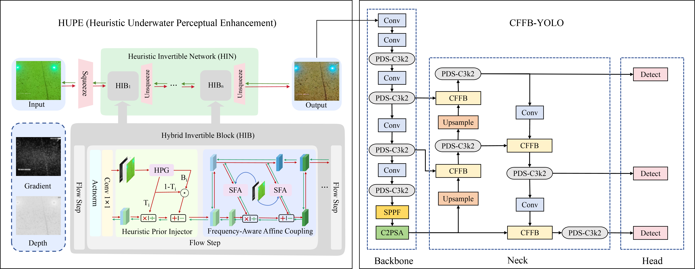

CFFB-YOLO11 is a underwater structural crack detection model
Since this is my first article, I’ve limited myself to just one class of detection due to my limited capabilities.

## The structure of model


## Dataset Structe
If you want to train on custom datasets you should paper dataset as following structure:
```
|-mydataset
    |-train
        |-images
            |-xxx.png
        |-labels
            |-xxx.txt
    |-val
        |-images
            |-xxx.png
        |-labels
            |-xxx.txt
    |-test
        |-images
            |-xxx.png
    |-data.yaml
```

## Training

To train the model, run this command:

```train
python train.py
```
Retraining from a checkpoint
train_last.py
## Evaluation
val.py

## Predict
Inference test images
predict.py

## Generate a heatmap
heatmap.py

## Generate the receptive field
get_model_erf.py

## 
If you find our work useful in your research, please cite our paper:
```
@article{shen2026underwater,
  title={Underwater structural crack detection via inverse-domain alignment contextual-frequency feature fusion},
  author={Shen, Shiqin and Wei, Ruikai and Sun, Panfeng and Zhang, Xuewu},
  journal={Marine Structures},
  volume={109},
  pages={104039},
  year={2026},
  publisher={Elsevier}
}
```